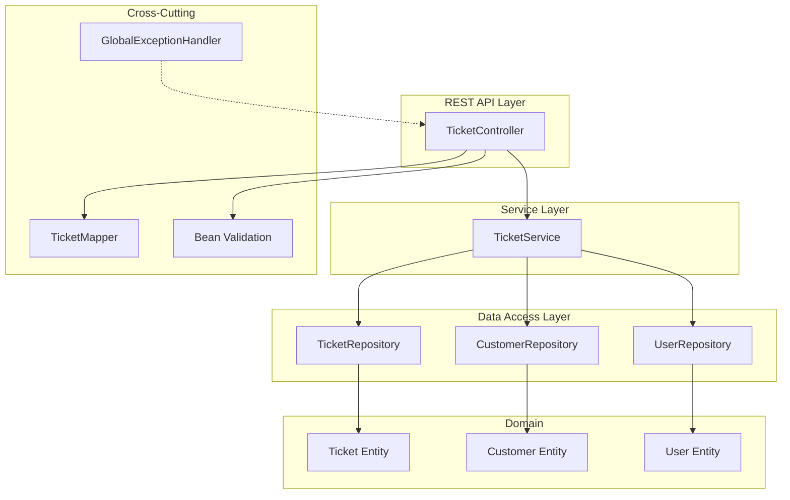
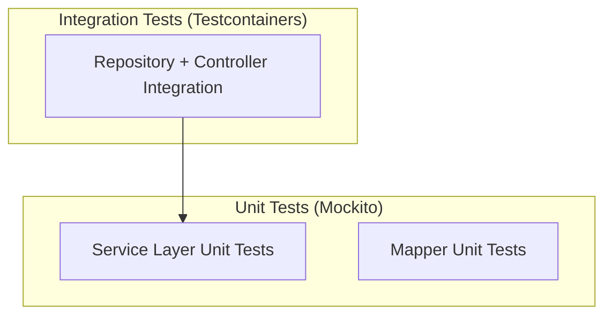

# Design Document: Phase 1 Foundation — Ticket CRUD

## Overview

This design establishes the foundational Spring Boot application for the AI Customer Support Assistant. The scope is deliberately narrow: a clean, production-quality Ticket CRUD API with PostgreSQL persistence, proper layered architecture, and comprehensive testing. Authentication, authorization, and AI features are excluded from this implementation phase.

The application follows a standard Spring Boot layered architecture: Controller → Service → Repository → Entity, with DTOs and Mappers at API boundaries. Global exception handling provides consistent error responses, and Bean Validation ensures input integrity.

### Key Design Decisions

1. **No Spring Security in this phase** — Authentication and authorization will be added in a later phase. All endpoints are open for now.
2. **Categories updated** — Ticket categories are: TECHNICAL, BILLING, ACCOUNT, PRODUCT, DELIVERY, OTHER (not GENERAL).
3. **Constructor-based DI** — All Spring beans use constructor injection (no field injection).
4. **JPA Auditing** — `@CreatedDate` and `@LastModifiedDate` handle timestamp management automatically.
5. **Transactions** — Service methods are `@Transactional` where appropriate.
6. **Soft entities** — User and Customer entities exist in the schema but full CRUD for them is deferred. Ticket CRUD is the primary focus.

## Architecture



### Package Structure

```
com.example.support
├── config/                  # Spring configuration classes
│   └── JpaAuditingConfig.java
├── controller/              # REST controllers
│   └── TicketController.java
├── dto/                     # Data Transfer Objects
│   ├── request/
│   │   ├── CreateTicketRequest.java
│   │   └── UpdateTicketRequest.java
│   └── response/
│       ├── TicketResponse.java
│       ├── CustomerSummary.java
│       ├── AgentSummary.java
│       └── ErrorResponse.java
├── entity/                  # JPA entities
│   ├── Ticket.java
│   ├── Customer.java
│   ├── User.java
│   └── enums/
│       ├── TicketStatus.java
│       ├── TicketPriority.java
│       ├── TicketCategory.java
│       └── UserRole.java
├── exception/               # Custom exceptions and handler
│   ├── GlobalExceptionHandler.java
│   ├── ResourceNotFoundException.java
│   └── DuplicateResourceException.java
├── mapper/                  # Entity ↔ DTO mappers
│   └── TicketMapper.java
├── repository/              # Spring Data JPA repositories
│   ├── TicketRepository.java
│   ├── CustomerRepository.java
│   └── UserRepository.java
├── service/                 # Business logic
│   └── TicketService.java
└── SupportApplication.java  # Main application class
```

## Components and Interfaces

### Controller Layer

#### TicketController

```java
@RestController
@RequestMapping("/api/tickets")
public class TicketController {

    private final TicketService ticketService;
    private final TicketMapper ticketMapper;

    // Constructor injection

    @PostMapping
    ResponseEntity<TicketResponse> createTicket(@Valid @RequestBody CreateTicketRequest request);

    @GetMapping
    ResponseEntity<List<TicketResponse>> getAllTickets();

    @GetMapping("/{id}")
    ResponseEntity<TicketResponse> getTicketById(@PathVariable Long id);

    @PutMapping("/{id}")
    ResponseEntity<TicketResponse> updateTicket(@PathVariable Long id, @Valid @RequestBody UpdateTicketRequest request);

    @DeleteMapping("/{id}")
    ResponseEntity<Void> deleteTicket(@PathVariable Long id);
}
```

### Service Layer

#### TicketService

```java
@Service
@Transactional(readOnly = true)
public class TicketService {

    private final TicketRepository ticketRepository;
    private final CustomerRepository customerRepository;
    private final UserRepository userRepository;

    // Constructor injection

    @Transactional
    public Ticket createTicket(CreateTicketRequest request);

    public List<Ticket> getAllTickets();

    public Ticket getTicketById(Long id);

    @Transactional
    public Ticket updateTicket(Long id, UpdateTicketRequest request);

    @Transactional
    public void deleteTicket(Long id);
}
```

**Design Rationale:** The service layer is `@Transactional(readOnly = true)` at class level, with write operations explicitly marked `@Transactional`. This optimizes read operations and ensures writes are properly transactional.

### Repository Layer

```java
public interface TicketRepository extends JpaRepository<Ticket, Long> {
    List<Ticket> findByStatus(TicketStatus status);
    List<Ticket> findByCustomerId(Long customerId);
    List<Ticket> findByAssignedAgentId(Long agentId);
}

public interface CustomerRepository extends JpaRepository<Customer, Long> {
    Optional<Customer> findByEmail(String email);
    boolean existsByEmail(String email);
}

public interface UserRepository extends JpaRepository<User, Long> {
    Optional<User> findByUsername(String username);
    boolean existsByUsername(String username);
    boolean existsByEmail(String email);
}
```

### Mapper Layer

#### TicketMapper

```java
@Component
public class TicketMapper {

    public TicketResponse toResponse(Ticket ticket);
    public CustomerSummary toCustomerSummary(Customer customer);
    public AgentSummary toAgentSummary(User agent);
}
```

**Design Rationale:** Manual mapper (no MapStruct) to keep dependencies minimal and logic explicit. The mapper handles null agent gracefully by returning null for the `assignedAgent` field in the response.

### Global Exception Handler

```java
@RestControllerAdvice
public class GlobalExceptionHandler {

    @ExceptionHandler(ResourceNotFoundException.class)
    ResponseEntity<ErrorResponse> handleNotFound(ResourceNotFoundException ex, HttpServletRequest request);

    @ExceptionHandler(DuplicateResourceException.class)
    ResponseEntity<ErrorResponse> handleConflict(DuplicateResourceException ex, HttpServletRequest request);

    @ExceptionHandler(MethodArgumentNotValidException.class)
    ResponseEntity<ErrorResponse> handleValidation(MethodArgumentNotValidException ex, HttpServletRequest request);

    @ExceptionHandler(HttpMessageNotReadableException.class)
    ResponseEntity<ErrorResponse> handleMalformedJson(HttpMessageNotReadableException ex, HttpServletRequest request);

    @ExceptionHandler(HttpRequestMethodNotSupportedException.class)
    ResponseEntity<ErrorResponse> handleMethodNotAllowed(HttpRequestMethodNotSupportedException ex, HttpServletRequest request);

    @ExceptionHandler(Exception.class)
    ResponseEntity<ErrorResponse> handleGeneral(Exception ex, HttpServletRequest request);
}
```

## Data Models

### Enums

```java
public enum TicketStatus {
    OPEN, IN_PROGRESS, RESOLVED, CLOSED
}

public enum TicketPriority {
    LOW, MEDIUM, HIGH, CRITICAL
}

public enum TicketCategory {
    TECHNICAL, BILLING, ACCOUNT, PRODUCT, DELIVERY, OTHER
}

public enum UserRole {
    ADMIN, SUPPORT_AGENT
}
```

### Ticket Entity

```java
@Entity
@Table(name = "tickets")
@EntityListeners(AuditingEntityListener.class)
public class Ticket {

    @Id
    @GeneratedValue(strategy = GenerationType.IDENTITY)
    private Long id;

    @Column(nullable = false, length = 150)
    private String title;

    @Column(nullable = false, length = 2000)
    private String description;

    @Enumerated(EnumType.STRING)
    @Column(nullable = false, length = 20)
    private TicketStatus status;

    @Enumerated(EnumType.STRING)
    @Column(nullable = false, length = 20)
    private TicketPriority priority;

    @Enumerated(EnumType.STRING)
    @Column(nullable = false, length = 20)
    private TicketCategory category;

    @ManyToOne(fetch = FetchType.LAZY)
    @JoinColumn(name = "customer_id", nullable = false)
    private Customer customer;

    @ManyToOne(fetch = FetchType.LAZY)
    @JoinColumn(name = "assigned_agent_id")
    private User assignedAgent;

    @CreatedDate
    @Column(nullable = false, updatable = false)
    private LocalDateTime createdAt;

    @LastModifiedDate
    @Column(nullable = false)
    private LocalDateTime updatedAt;

    @Column
    private LocalDateTime resolvedAt;
}
```

### Customer Entity

```java
@Entity
@Table(name = "customers")
@EntityListeners(AuditingEntityListener.class)
public class Customer {

    @Id
    @GeneratedValue(strategy = GenerationType.IDENTITY)
    private Long id;

    @Column(name = "first_name", nullable = false, length = 50)
    private String firstName;

    @Column(name = "last_name", nullable = false, length = 50)
    private String lastName;

    @Column(nullable = false, unique = true, length = 100)
    private String email;

    @Column(length = 20)
    private String phone;

    @Column(length = 100)
    private String company;

    @CreatedDate
    @Column(nullable = false, updatable = false)
    private LocalDateTime createdAt;

    @LastModifiedDate
    @Column(nullable = false)
    private LocalDateTime updatedAt;
}
```

### User Entity

```java
@Entity
@Table(name = "users")
@EntityListeners(AuditingEntityListener.class)
public class User {

    @Id
    @GeneratedValue(strategy = GenerationType.IDENTITY)
    private Long id;

    @Column(nullable = false, unique = true, length = 50)
    private String username;

    @Column(nullable = false, unique = true, length = 100)
    private String email;

    @Column(nullable = false, length = 255)
    private String password;

    @Enumerated(EnumType.STRING)
    @Column(nullable = false, length = 20)
    private UserRole role;

    @CreatedDate
    @Column(nullable = false, updatable = false)
    private LocalDateTime createdAt;

    @LastModifiedDate
    @Column(nullable = false)
    private LocalDateTime updatedAt;
}
```

### Request DTOs

#### CreateTicketRequest

```java
public record CreateTicketRequest(
    @NotBlank(message = "Title is required")
    @Size(max = 150, message = "Title must not exceed 150 characters")
    String title,

    @NotBlank(message = "Description is required")
    @Size(max = 2000, message = "Description must not exceed 2000 characters")
    String description,

    @NotNull(message = "Priority is required")
    TicketPriority priority,

    @NotNull(message = "Category is required")
    TicketCategory category,

    @NotNull(message = "Customer ID is required")
    Long customerId,

    Long assignedAgentId  // nullable — ticket can be unassigned
) {}
```

#### UpdateTicketRequest

```java
public record UpdateTicketRequest(
    @Size(max = 150, message = "Title must not exceed 150 characters")
    String title,

    @Size(max = 2000, message = "Description must not exceed 2000 characters")
    String description,

    TicketStatus status,

    TicketPriority priority,

    TicketCategory category,

    Long assignedAgentId  // nullable — can unassign
) {}
```

**Design Rationale:** `UpdateTicketRequest` fields are all nullable. Only non-null fields in the request body will be applied (partial update semantics). This avoids requiring the client to send the entire object for minor changes.

### Response DTOs

#### TicketResponse

```java
public record TicketResponse(
    Long id,
    String title,
    String description,
    TicketStatus status,
    TicketPriority priority,
    TicketCategory category,
    CustomerSummary customer,
    AgentSummary assignedAgent,  // nullable
    LocalDateTime createdAt,
    LocalDateTime updatedAt,
    LocalDateTime resolvedAt     // nullable
) {}
```

#### CustomerSummary

```java
public record CustomerSummary(
    Long id,
    String firstName,
    String lastName,
    String email
) {}
```

#### AgentSummary

```java
public record AgentSummary(
    Long id,
    String username,
    String email
) {}
```

#### ErrorResponse

```java
public record ErrorResponse(
    String timestamp,      // ISO 8601 UTC
    int status,
    String error,          // e.g., "Not Found", "Validation Error"
    String message,
    String path,
    List<FieldError> fieldErrors  // nullable, present only for validation errors
) {
    public record FieldError(
        String field,
        String message
    ) {}
}
```


## Correctness Properties

*A property is a characteristic or behavior that should hold true across all valid executions of a system — essentially, a formal statement about what the system should do. Properties serve as the bridge between human-readable specifications and machine-verifiable correctness guarantees.*

### Property 1: Entity Persistence Round-Trip

*For any* valid Ticket entity (with valid customer and optional agent references), persisting it to the database and then retrieving it by ID SHALL produce an entity with identical field values for title, description, status, priority, category, customer reference, and assigned agent reference.

**Validates: Requirements 2.1, 2.2, 2.3**

### Property 2: JPA Auditing Timestamps

*For any* entity (Ticket, Customer, or User) that is newly persisted, createdAt SHALL be non-null and within a reasonable delta of the current time. *For any* entity that is subsequently modified and saved, updatedAt SHALL be strictly greater than or equal to its previous value and different from the original updatedAt.

**Validates: Requirements 2.10, 2.11**

### Property 3: Repository Filter Correctness

*For any* set of persisted Tickets with varying statuses, calling `findByStatus(s)` SHALL return exactly and only those tickets whose status equals `s`. The same holds for `findByCustomerId` and `findByAssignedAgentId`.

**Validates: Requirements 3.3**

### Property 4: Ticket Creation Defaults to OPEN

*For any* valid `CreateTicketRequest` (with a valid customer reference and valid priority/category), the created Ticket SHALL always have status `OPEN` regardless of any other input values.

**Validates: Requirements 9.1**

### Property 5: GET All Returns Complete Set

*For any* set of N tickets persisted in the database, a GET request to `/api/tickets` SHALL return exactly N ticket records, and the set of returned IDs SHALL equal the set of persisted IDs.

**Validates: Requirements 9.2**

### Property 6: GET by ID Round-Trip

*For any* Ticket created via the POST endpoint, a subsequent GET request to `/api/tickets/{id}` SHALL return a response whose title, description, status, priority, category, and customer ID match the values used during creation.

**Validates: Requirements 9.3**

### Property 7: Update Applies Only Mutable Fields

*For any* existing Ticket and any valid `UpdateTicketRequest` containing a subset of mutable fields (title, description, status, priority, category, assignedAgentId), after a PUT request, only the fields present in the request SHALL change. All other fields (id, customerId, createdAt) SHALL remain unchanged.

**Validates: Requirements 9.4, 9.5**

### Property 8: RESOLVED Status Sets resolvedAt

*For any* Ticket whose status is changed to `RESOLVED` via an update, the resulting Ticket SHALL have a non-null `resolvedAt` timestamp. *For any* Ticket whose status is changed to a value other than `RESOLVED`, `resolvedAt` SHALL remain null (or unchanged if previously resolved).

**Validates: Requirements 9.6**

### Property 9: Invalid Inputs Rejected with Structured Error

*For any* request DTO that violates Bean Validation constraints (blank required fields, oversized strings, invalid email format), the API SHALL return HTTP 400 with a response containing a non-empty `fieldErrors` list where each entry specifies the violating field name and a human-readable message.

**Validates: Requirements 10.1, 10.2, 10.3, 10.4**

### Property 10: Error Responses Are Consistent and Never Leak Internals

*For any* exception thrown during request processing, the error response SHALL contain all required fields (timestamp in ISO 8601, status as integer, error type as string, message, and path). *For any* unexpected exception (500), the message SHALL NOT contain Java class names, line numbers, or stack trace fragments.

**Validates: Requirements 11.1, 11.5**

### Property 11: Mapper Preserves Entity Data in Response DTO

*For any* Ticket entity with a non-null customer and optional agent, mapping to `TicketResponse` SHALL produce a DTO where: the top-level fields (id, title, description, status, priority, category, timestamps) match the entity, the `customer` nested object matches the customer's id/firstName/lastName/email, and the `assignedAgent` (if present) matches the agent's id/username/email. If the agent is null, `assignedAgent` SHALL be null in the response.

**Validates: Requirements 12.2, 12.4, 12.5**

### Property 12: Password Never Appears in Response

*For any* User entity with a non-empty password field, mapping to any response DTO SHALL produce an object that does not contain the password value in any field.

**Validates: Requirements 12.3**

## Error Handling

### Exception Hierarchy

| Exception | HTTP Status | When Thrown |
|-----------|------------|-------------|
| `ResourceNotFoundException` | 404 | Entity not found by ID |
| `DuplicateResourceException` | 409 | Unique constraint violation (email, username) |
| `MethodArgumentNotValidException` | 400 | Bean Validation failure (Spring auto-throws) |
| `HttpMessageNotReadableException` | 400 | Malformed JSON body |
| `HttpRequestMethodNotSupportedException` | 405 | Wrong HTTP method on endpoint |
| `Exception` (catch-all) | 500 | Unexpected server error |

### Error Response Format

All errors follow a consistent structure:

```json
{
  "timestamp": "2024-01-15T10:30:00Z",
  "status": 400,
  "error": "Validation Error",
  "message": "Request validation failed",
  "path": "/api/tickets",
  "fieldErrors": [
    {
      "field": "title",
      "message": "Title is required"
    }
  ]
}
```

The `fieldErrors` array is only present for validation errors (400). For all other error types, it is omitted or null.

### Error Handling Strategy

1. **Controller layer** — Never catches exceptions directly. Relies on `@Valid` for input validation and lets exceptions propagate.
2. **Service layer** — Throws domain exceptions (`ResourceNotFoundException`, `DuplicateResourceException`) when business rules are violated.
3. **GlobalExceptionHandler** — Catches all exceptions, maps them to consistent `ErrorResponse` objects, and ensures no internal details leak in production.

## Testing Strategy

### Testing Pyramid



### Unit Tests (JUnit 5 + Mockito)

**Scope:** Service layer, Mapper layer

- **TicketServiceTest** — Mock `TicketRepository`, `CustomerRepository`, `UserRepository`. Test:
  - `createTicket` — verifies OPEN status, customer lookup, save
  - `getAllTickets` — verifies delegation to repository
  - `getTicketById` — verifies found/not-found paths
  - `updateTicket` — verifies partial updates, resolvedAt on RESOLVED
  - `deleteTicket` — verifies found/not-found paths

- **TicketMapperTest** — No mocks needed (pure logic). Test:
  - Mapping Ticket entity → TicketResponse (all fields)
  - Null agent → null in response
  - Customer summary mapping

### Integration Tests (JUnit 5 + Testcontainers + Spring Boot Test)

**Scope:** Repository layer, Controller layer (end-to-end)

- **TicketRepositoryIntegrationTest** — Uses `@DataJpaTest` with Testcontainers PostgreSQL:
  - CRUD operations
  - Custom queries (`findByStatus`, `findByCustomerId`, `findByAssignedAgentId`)
  - JPA auditing (createdAt, updatedAt)

- **TicketControllerIntegrationTest** — Uses `@SpringBootTest` + `TestRestTemplate` with Testcontainers:
  - POST /api/tickets — valid creation (201), invalid body (400), non-existent customer (404)
  - GET /api/tickets — returns all tickets (200)
  - GET /api/tickets/{id} — found (200), not found (404)
  - PUT /api/tickets/{id} — valid update (200), not found (404), invalid body (400)
  - DELETE /api/tickets/{id} — success (204), not found (404)

### Property-Based Tests (JUnit 5 + jqwik)

**Library:** [jqwik](https://jqwik.net/) — property-based testing for JUnit 5

Each correctness property from the design document is implemented as a jqwik `@Property` test with a minimum of 100 iterations. Tests are tagged with the property they validate.

**Configuration:**
- Minimum 100 tries per property
- Custom arbitraries for domain objects (valid titles, descriptions, enum values)
- Testcontainers for properties requiring persistence

**Tag format:** `Feature: phase1-foundation, Property {number}: {title}`

Example test structure:
```java
@Property(tries = 100)
@Tag("Feature: phase1-foundation, Property 4: Ticket Creation Defaults to OPEN")
void ticketCreationAlwaysOpen(@ForAll @From("validCreateTicketRequest") CreateTicketRequest request) {
    Ticket ticket = ticketService.createTicket(request);
    assertThat(ticket.getStatus()).isEqualTo(TicketStatus.OPEN);
}
```

### Test Configuration

```java
@Testcontainers
@SpringBootTest
abstract class BaseIntegrationTest {

    @Container
    static PostgreSQLContainer<?> postgres = new PostgreSQLContainer<>("postgres:15-alpine")
        .withDatabaseName("support_test")
        .withUsername("test")
        .withPassword("test");

    @DynamicPropertySource
    static void configureProperties(DynamicPropertyRegistry registry) {
        registry.add("spring.datasource.url", postgres::getJdbcUrl);
        registry.add("spring.datasource.username", postgres::getUsername);
        registry.add("spring.datasource.password", postgres::getPassword);
    }
}
```

### Test Independence

- Each test class extends `BaseIntegrationTest` (for integration tests)
- `@Transactional` on integration tests for automatic rollback
- No shared mutable state between test methods
- Each test creates its own test data

## Configuration

### application.yml

```yaml
spring:
  application:
    name: ai-customer-support-assistant

  datasource:
    url: jdbc:postgresql://${DB_HOST:localhost}:${DB_PORT:5432}/${DB_NAME:support_db}
    username: ${DB_USERNAME:support_user}
    password: ${DB_PASSWORD:support_pass}
    driver-class-name: org.postgresql.Driver

  jpa:
    hibernate:
      ddl-auto: validate
    open-in-view: false
    properties:
      hibernate:
        dialect: org.hibernate.dialect.PostgreSQLDialect
        format_sql: true

  flyway:
    enabled: true
    locations: classpath:db/migration

server:
  port: ${SERVER_PORT:8080}

logging:
  level:
    com.example.support: DEBUG
    org.hibernate.SQL: DEBUG
```

### application-test.yml

```yaml
spring:
  jpa:
    hibernate:
      ddl-auto: create-drop
  flyway:
    enabled: false

logging:
  level:
    com.example.support: DEBUG
```

### Docker Compose (docker-compose.yml)

```yaml
version: '3.8'

services:
  postgres:
    image: postgres:15-alpine
    container_name: support-db
    environment:
      POSTGRES_DB: ${DB_NAME:-support_db}
      POSTGRES_USER: ${DB_USERNAME:-support_user}
      POSTGRES_PASSWORD: ${DB_PASSWORD:-support_pass}
    ports:
      - "${DB_PORT:-5432}:5432"
    volumes:
      - postgres_data:/var/lib/postgresql/data
    healthcheck:
      test: ["CMD-SHELL", "pg_isready -U ${DB_USERNAME:-support_user}"]
      interval: 10s
      timeout: 5s
      retries: 5

volumes:
  postgres_data:
```

### Database Migration (Flyway)

Schema management uses Flyway migrations rather than Hibernate `ddl-auto=update`. Initial migration:

```sql
-- V1__initial_schema.sql

CREATE TABLE users (
    id BIGSERIAL PRIMARY KEY,
    username VARCHAR(50) NOT NULL UNIQUE,
    email VARCHAR(100) NOT NULL UNIQUE,
    password VARCHAR(255) NOT NULL,
    role VARCHAR(20) NOT NULL,
    created_at TIMESTAMP NOT NULL DEFAULT NOW(),
    updated_at TIMESTAMP NOT NULL DEFAULT NOW()
);

CREATE TABLE customers (
    id BIGSERIAL PRIMARY KEY,
    first_name VARCHAR(50) NOT NULL,
    last_name VARCHAR(50) NOT NULL,
    email VARCHAR(100) NOT NULL UNIQUE,
    phone VARCHAR(20),
    company VARCHAR(100),
    created_at TIMESTAMP NOT NULL DEFAULT NOW(),
    updated_at TIMESTAMP NOT NULL DEFAULT NOW()
);

CREATE TABLE tickets (
    id BIGSERIAL PRIMARY KEY,
    title VARCHAR(150) NOT NULL,
    description VARCHAR(2000) NOT NULL,
    status VARCHAR(20) NOT NULL DEFAULT 'OPEN',
    priority VARCHAR(20) NOT NULL,
    category VARCHAR(20) NOT NULL,
    customer_id BIGINT NOT NULL REFERENCES customers(id),
    assigned_agent_id BIGINT REFERENCES users(id),
    created_at TIMESTAMP NOT NULL DEFAULT NOW(),
    updated_at TIMESTAMP NOT NULL DEFAULT NOW(),
    resolved_at TIMESTAMP
);

CREATE INDEX idx_tickets_status ON tickets(status);
CREATE INDEX idx_tickets_customer_id ON tickets(customer_id);
CREATE INDEX idx_tickets_assigned_agent_id ON tickets(assigned_agent_id);
```

### Key Dependencies (pom.xml)

```xml
<parent>
    <groupId>org.springframework.boot</groupId>
    <artifactId>spring-boot-starter-parent</artifactId>
    <version>3.2.5</version>
</parent>

<properties>
    <java.version>21</java.version>
    <testcontainers.version>1.19.7</testcontainers.version>
</properties>

<dependencies>
    <!-- Core -->
    <dependency>
        <groupId>org.springframework.boot</groupId>
        <artifactId>spring-boot-starter-web</artifactId>
    </dependency>
    <dependency>
        <groupId>org.springframework.boot</groupId>
        <artifactId>spring-boot-starter-data-jpa</artifactId>
    </dependency>
    <dependency>
        <groupId>org.springframework.boot</groupId>
        <artifactId>spring-boot-starter-validation</artifactId>
    </dependency>

    <!-- Database -->
    <dependency>
        <groupId>org.postgresql</groupId>
        <artifactId>postgresql</artifactId>
        <scope>runtime</scope>
    </dependency>
    <dependency>
        <groupId>org.flywaydb</groupId>
        <artifactId>flyway-core</artifactId>
    </dependency>
    <dependency>
        <groupId>org.flywaydb</groupId>
        <artifactId>flyway-database-postgresql</artifactId>
    </dependency>

    <!-- Testing -->
    <dependency>
        <groupId>org.springframework.boot</groupId>
        <artifactId>spring-boot-starter-test</artifactId>
        <scope>test</scope>
    </dependency>
    <dependency>
        <groupId>org.testcontainers</groupId>
        <artifactId>postgresql</artifactId>
        <version>${testcontainers.version}</version>
        <scope>test</scope>
    </dependency>
    <dependency>
        <groupId>org.testcontainers</groupId>
        <artifactId>junit-jupiter</artifactId>
        <version>${testcontainers.version}</version>
        <scope>test</scope>
    </dependency>
    <dependency>
        <groupId>net.jqwik</groupId>
        <artifactId>jqwik</artifactId>
        <version>1.8.4</version>
        <scope>test</scope>
    </dependency>
</dependencies>
```

**Note:** Spring Security is intentionally excluded from this phase. It will be added in a future phase for JWT authentication and role-based authorization.
